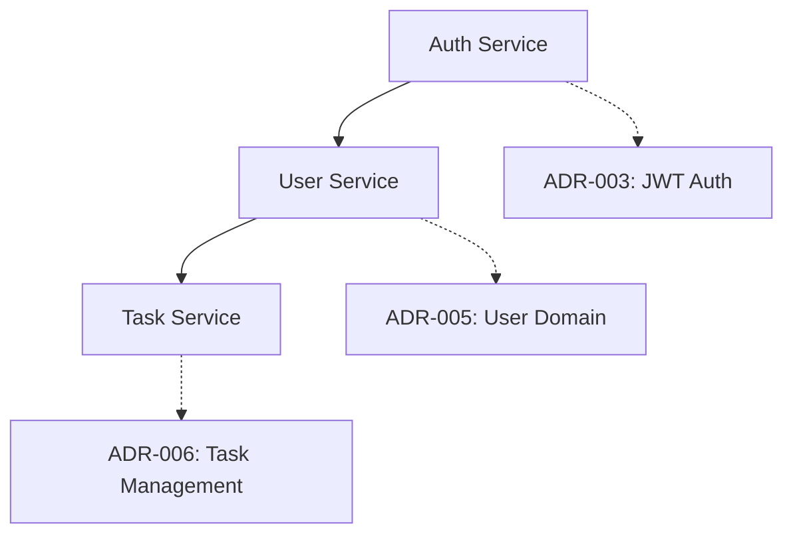

# Decision-to-Implementation Traceability Guidelines

*Establishing Clear Links Between DDSE Decisions and Code Implementation*

## Overview

Decision-to-Implementation Traceability ensures that every significant piece of code can be traced back to the architectural, engineering, or implementation decisions that justified its creation. This traceability is essential for:

- **Maintaining architectural integrity** over time
- **Enabling AI-assisted development** with proper decision context
- **Facilitating code reviews** with clear decision rationale
- **Supporting refactoring** with understanding of original intent
- **Onboarding new team members** with decision-code relationships

## Traceability Levels

### Level 1: Direct Decision References
Code components directly implement a specific TDR decision.

```typescript
// Direct reference to ADR-003: JWT Authentication Strategy
/**
 * @implements ADR-003: JWT Authentication Strategy
 * @see tdr/adr/adr-003-jwt-authentication.md
 */
export class AuthenticationService {
  // Implementation follows ADR-003 specifications
}
```

### Level 2: Contract Implementation
Code implements a specific CDR contract specification.

```typescript
// Implementation of CDR-001: User Management API Contract
/**
 * @implements CDR-001: User Management API Contract
 * @contract /api/v1/users endpoints
 * @see tdr/cdr/cdr-001-user-management-api.md
 */
@Controller('/api/v1/users')
export class UserController {
  // Endpoints implement CDR-001 specifications
}
```

### Level 3: Pattern Adherence
Code follows patterns established in EDR or IDR decisions.

```typescript
// Follows IDR-005: Error Handling Patterns
/**
 * @pattern IDR-005: Standardized Error Handling
 * @see tdr/idr/idr-005-error-handling-patterns.md
 */
export class ServiceError extends Error {
  // Error handling follows IDR-005 patterns
}
```

## Traceability Mechanisms

### 1. Code Annotations

#### Decision Implementation Tags
```typescript
// Tag format: @implements <TDR-ID>: <TDR-Title>
/**
 * @implements ADR-004: Database Connection Strategy
 * @implements EDR-002: ORM Selection and Configuration
 */
export class DatabaseService {
  // Implementation details
}
```

#### Contract Compliance Tags
```typescript
// Tag format: @contract <endpoint-or-schema>
/**
 * @contract GET /api/v1/tasks/{id}
 * @contract TaskResponse schema
 * @implements CDR-003: Task Management API Contract
 */
export async function getTaskById(id: string): Promise<TaskResponse> {
  // Implementation follows CDR-003 contract
}
```

#### Pattern Adherence Tags
```typescript
// Tag format: @pattern <TDR-ID>: <Pattern-Name>
/**
 * @pattern EDR-001: Repository Pattern Implementation
 * @pattern IDR-003: Async Error Handling
 */
export class TaskRepository {
  // Implementation follows established patterns
}
```

### 2. File-Level Traceability

#### TDR Reference Headers
```typescript
/**
 * @file UserService.ts
 * @description User management business logic
 * 
 * @implements ADR-005: User Domain Model
 * @implements CDR-001: User Management API Contract
 * @implements EDR-003: Service Layer Patterns
 * @implements IDR-007: User Validation Rules
 * 
 * @see tdr/adr/adr-005-user-domain-model.md
 * @see tdr/cdr/cdr-001-user-management-api.md
 */
```

#### Decision Impact Comments
```typescript
// ADR-002: Microservices Architecture
// This service is designed as a standalone microservice
// with independent deployment and scaling capabilities
export class UserService {
  // Service implementation
}
```

### 3. Directory Structure Traceability

#### Decision-Aligned Organization
```
src/
├── services/           # ADR-002: Microservices Architecture
│   ├── auth/          # ADR-003: Authentication Service
│   ├── user/          # ADR-005: User Domain Service
│   └── task/          # ADR-006: Task Management Service
├── contracts/         # CDR contracts implementation
│   ├── api/           # CDR-001, CDR-002, CDR-003
│   └── schemas/       # Data schemas from CDRs
├── patterns/          # EDR and IDR pattern implementations
│   ├── repository/    # EDR-001: Repository Pattern
│   ├── middleware/    # EDR-002: Middleware Strategy
│   └── errors/        # IDR-005: Error Handling Patterns
```

#### README References
```markdown
# Service Directory Structure

This directory structure implements the following decisions:

- **ADR-002**: Microservices Architecture - Each service is independently deployable
- **EDR-001**: Repository Pattern - Data access layer separation
- **IDR-003**: Async Patterns - All async operations follow established patterns

## Service Dependencies



### 4. Test Traceability

#### Decision Validation Tests
```typescript
/**
 * @test ADR-003: JWT Authentication Strategy
 * @validates JWT token generation and validation
 */
describe('JWT Authentication (ADR-003)', () => {
  test('should generate valid JWT tokens per ADR-003 spec', () => {
    // Test implementation follows ADR-003 requirements
  });
});
```

#### Contract Compliance Tests
```typescript
/**
 * @test CDR-001: User Management API Contract
 * @validates All endpoints match OpenAPI specification
 */
describe('User API Contract (CDR-001)', () => {
  test('GET /api/v1/users/{id} matches CDR-001 spec', async () => {
    // Test validates contract compliance
  });
});
```

### 5. Documentation Traceability

#### Decision Implementation Matrix
```markdown
# Decision Implementation Matrix

| Decision | Components | Tests | Documentation |
|----------|------------|-------|---------------|
| ADR-003: JWT Auth | AuthService.ts, auth.middleware.ts | auth.test.ts, jwt.test.ts | auth-api.md |
| CDR-001: User API | UserController.ts, UserService.ts | user-api.test.ts | user-endpoints.md |
| EDR-001: Repository | BaseRepository.ts, UserRepository.ts | repository.test.ts | repository-guide.md |
```

#### Impact Analysis Documentation
```markdown
# ADR-003 Implementation Impact

## Affected Components
- `src/services/auth/AuthService.ts` - Core authentication logic
- `src/middleware/auth.middleware.ts` - Request authentication
- `src/controllers/UserController.ts` - Protected endpoints

## Test Coverage
- `tests/auth/AuthService.test.ts` - Unit tests for auth logic
- `tests/integration/auth-flow.test.ts` - Integration tests
- `tests/contracts/auth-api.test.ts` - Contract validation

## Configuration Impact
- `config/jwt.config.ts` - JWT configuration per ADR-003
- `env/development.env` - Development JWT settings
```

## Automation Tools

### 1. Traceability Validation Scripts

#### Decision Coverage Analysis
```bash
#!/bin/bash
# analyze-decision-coverage.sh
# Validates that all TDRs have corresponding implementation

echo "Analyzing decision-to-code traceability..."

for tdr in tdr/**/*.md; do
  tdr_id=$(grep -o "^id: .*" "$tdr" | cut -d' ' -f2)
  if [ ! -z "$tdr_id" ]; then
    # Search for @implements references
    impl_count=$(grep -r "@implements $tdr_id" src/ | wc -l)
    echo "$tdr_id: $impl_count implementations found"
  fi
done
```

#### Contract Implementation Validation
```typescript
// validate-contracts.ts
// Ensures all CDR contracts have corresponding implementations

import { parseOpenAPISpec } from './utils/openapi-parser';
import { analyzeCodebase } from './utils/code-analysis';

export async function validateContractImplementation() {
  const contracts = await parseOpenAPISpec('tdr/cdr/');
  const implementations = await analyzeCodebase('src/');
  
  for (const contract of contracts) {
    const hasImplementation = implementations.some(impl => 
      impl.annotations.includes(`@contract ${contract.endpoint}`)
    );
    
    if (!hasImplementation) {
      console.warn(`Missing implementation for ${contract.endpoint}`);
    }
  }
}
```

### 2. IDE Integration

#### VS Code Extension Configuration
```json
{
  "ddse.traceability": {
    "tdrDirectory": "tdr/",
    "sourceDirectory": "src/",
    "enableAnnotationHints": true,
    "validateImplementations": true,
    "showDecisionLinks": true
  }
}
```

#### Annotation Auto-completion
```typescript
// IDE auto-completion for @implements tags
// Based on available TDR files in the project

/**
 * Auto-complete suggestions:
 * @implements ADR-003: JWT Authentication Strategy
 * @implements CDR-001: User Management API Contract  
 * @implements EDR-001: Repository Pattern Implementation
 */
```

### 3. CI/CD Integration

#### Traceability Validation Pipeline
```yaml
# .github/workflows/traceability-check.yml
name: Decision Traceability Validation

on: [push, pull_request]

jobs:
  validate-traceability:
    runs-on: ubuntu-latest
    steps:
      - uses: actions/checkout@v2
      - name: Validate TDR Implementation Coverage
        run: |
          ./scripts/analyze-decision-coverage.sh
          npm run validate-contracts
          npm run test-decision-compliance
```

#### Code Review Integration
```typescript
// pr-traceability-check.ts
// Validates that new code includes proper decision references

export function validatePRTraceability(changedFiles: string[]) {
  const newImplementations = changedFiles.filter(file => 
    file.endsWith('.ts') || file.endsWith('.js')
  );
  
  for (const file of newImplementations) {
    const hasDecisionReference = checkForDecisionAnnotations(file);
    if (!hasDecisionReference) {
      addPRComment(`${file} should include @implements annotation for decision traceability`);
    }
  }
}
```

## Traceability Best Practices

### 1. Consistent Annotation Patterns

#### Standard Format
```typescript
/**
 * @implements <TDR-ID>: <TDR-Title>
 * @contract <endpoint-or-schema> (for CDRs)
 * @pattern <TDR-ID>: <Pattern-Name>
 * @see <path-to-tdr-file>
 */
```

#### Multi-Decision References
```typescript
/**
 * Complex component implementing multiple decisions
 * 
 * @implements ADR-002: Microservices Architecture
 * @implements CDR-001: User Management API Contract
 * @implements EDR-003: Service Layer Patterns
 * @implements IDR-005: Error Handling Patterns
 */
export class UserService {
  // Implementation
}
```

### 2. Granular Traceability

#### Method-Level References
```typescript
export class AuthService {
  /**
   * @implements ADR-003: JWT token generation strategy
   * @pattern IDR-002: Secure token handling
   */
  generateAccessToken(user: User): string {
    // Implementation follows ADR-003 specifications
  }

  /**
   * @implements ADR-003: JWT token validation
   * @pattern EDR-004: Error handling for invalid tokens
   */
  validateToken(token: string): TokenValidationResult {
    // Token validation per ADR-003 requirements
  }
}
```

#### Configuration Traceability
```typescript
// config/database.config.ts
/**
 * @implements ADR-004: Database Connection Strategy
 * @implements EDR-002: Environment-based Configuration
 */
export const databaseConfig = {
  // Configuration follows ADR-004 decisions
  host: process.env.DB_HOST,
  pool: {
    min: 2,    // ADR-004: Minimum connection pool size
    max: 10    // ADR-004: Maximum connection pool size
  }
};
```

### 3. Evolution Traceability

#### Decision Update Impact
```typescript
/**
 * @implements ADR-003: JWT Authentication Strategy (v2.0)
 * @updated 2025-08-03: Added refresh token support per ADR-003 update
 * @see tdr/adr/adr-003-jwt-authentication.md#v2-refresh-tokens
 */
export class AuthService {
  // Updated implementation with refresh token support
}
```

#### Deprecation Tracking
```typescript
/**
 * @deprecated This implementation follows ADR-002 v1.0
 * @replaces Previous monolithic auth approach
 * @migration See ADR-003 for new JWT-based approach
 * @removal-date 2025-12-01
 */
export class LegacyAuthService {
  // Legacy implementation to be removed
}
```

## Quality Metrics

### 1. Coverage Metrics
- **Decision Implementation Coverage**: Percentage of TDRs with code implementations
- **Contract Compliance**: Percentage of CDRs with fully implemented contracts
- **Pattern Adherence**: Percentage of code following established patterns

### 2. Traceability Quality
- **Annotation Accuracy**: Percentage of @implements tags with valid TDR references
- **Link Validity**: Percentage of @see references pointing to existing files
- **Documentation Sync**: Alignment between code annotations and TDR content

### 3. Maintenance Metrics
- **Orphaned Code**: Code components without decision references
- **Outdated References**: Annotations pointing to superseded decisions
- **Implementation Drift**: Code diverging from documented decisions

## Conclusion

Decision-to-Implementation Traceability transforms code from isolated implementations into a coherent system where every component has clear architectural justification. This traceability enables:

- **Confident Refactoring**: Understanding why code exists before changing it
- **Effective Code Reviews**: Evaluating changes against documented decisions
- **AI-Assisted Development**: Providing rich context for code generation
- **Knowledge Preservation**: Maintaining architectural intent over time

By establishing clear links between decisions and implementation, teams can maintain architectural integrity while enabling rapid development and evolution.

---

*For tool support and automation, see the [DDSE Tooling Guide](../tools/README.md) and [Traceability Validation Scripts](../tools/traceability/).*
